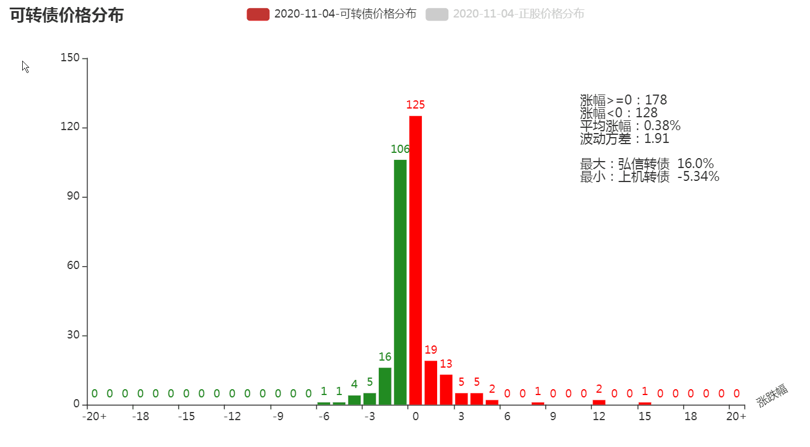

# 可转债量化分析 低风险投资者
- 可转债溢价率中位数与转债价格中位数图表

- 可转债不同评级对应的价格分布图

- 每天可转债价格分布 pyecharts

- 可转债资深玩家 QQ群：613194389   

## 可转债低费率开户：百万分之二，没有最低收费。关注公众可开户
## 另外提供开通券商量化交易接口，支持python编写实盘交易，有需要可关注公众号
 
- 公众号：可转债量化分析
